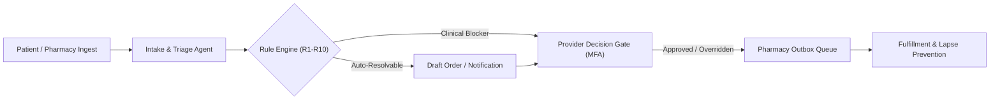

<p align="center">
  
</p>

<p align="center">
  <strong>The Autonomous Refill-Resolution Operating System for Physician Practices & Pharmacies</strong>
</p>

<p align="center">
  <em>From refill request to resolution — without losing anyone along the way.</em>
</p>

<p align="center">
  <a href="#about">About</a> •
  <a href="#what-it-does">Core Architecture</a> •
  <a href="#demo">Live Demo Credentials</a> •
  <a href="#environment-variables">Environment Variables</a> •
  <a href="#deploy-on-vercel">Deploy on Vercel</a> •
  <a href="#run-locally">Run Locally</a> •
  <a href="#documentation">Documentation</a>
</p>

---

## About

### Etymology & Philosophy
* **Oushadha (औषध)** — Medicine, healing, therapeutics.
* **Setu (सेतु)** — Bridge, connection, unifier.

**OushadhaSetu** is the operational bridge that sits between patients, pharmacies, clinic staff, providers, insurers, and EHR systems — exactly where prescription refills get delayed, dropped, or lost.

### The Real Problem: The "Silent Lapse"
When a patient’s refill request encounters an obstacle — zero refills remaining, required annual wellness visit, pending lab work, missing doctor’s signature, or insurance prior-authorization — traditional healthcare tools show only an ambiguous status badge: **"Pending approval"**.

Everyone already knows it is pending. But nobody knows:
* *Why* is it pending?
* *What* specific evidence is missing?
* *Who* owns the next action?
* *When* will the patient run out of medication?

As faxes and phone tags stall across disjointed portals, days turn into weeks. The patient silently runs out of chronic therapy, leading to preventable acute complications and emergency room visits.

### How OushadhaSetu Solves It: The 6 Operational Answers

| Operational Question | What OushadhaSetu Delivers |
|---|---|
| **What is happening now?** | Exact live state in a deterministic finite state machine (T1–T27) |
| **What is missing?** | Concrete gap (recency of lab, vital check, clinical note, PA form) |
| **What is blocking progress?** | Automated root-cause triage rule ID (R1–R10) |
| **Who can fix it?** | Named owner and clinical role (e.g., Dr. Anika Rao, Clinic Admin) |
| **What should happen next?** | Actionable recommendation, drafted communication, and urgency score |
| **Did it happen?** | Tamper-proof, cryptographically traceable audit timeline |

> [!IMPORTANT]
> **Clinical Human-in-the-Loop Gate**: AI acts solely as an investigative copilot (extracting faxes, summarizing chart recency, drafting notes). No medication order, refill quantity, or approval is ever transmitted without a licensed clinician's explicit authorization via step-up biometric/MFA (AAL2) verification.

---

## What It Does



* **Living Refill Cases**: Converts isolated faxes and messages into a persistent, living case with a dedicated owner, blocker classification, and strict SLA window.
* **Deterministic State Machine**: Governed by 27 validated transition rules (`supabase/functions/_shared/domain/state-machine.ts`), shared between client and server.
* **Multi-Agent Orchestration**: Six cooperative AI agents (Intake, Triage, Risk, Resolution, Communication, Audit) working under strict clinical protocols.
* **Zero Patient Login Wall**: Patients receive secure, tokenized SMS/email status links allowing them to track real-time resolution progress without navigating complex portal accounts.
* **Proactive Lapse Risk Engine**: Analyzes fill velocities and historical adherence to detect medication gaps before the patient's bottle is empty.
* **Outbox Reliability**: Background retry worker with exponential backoff and dead-letter queue handling for resilient pharmacy dispatches.

---

## Live Demo Credentials

The interactive demo runs a full **in-browser mock backend** (seeded cases, state machine, SLA escalation workers, MFA). You can evaluate every role without a live EHR or paid third-party API key.

* **Shared Demo Password**: `Refill!2026`
* **Demo MFA Code**: `123456`

| Persona | Demo Email | Role | Landing Route |
|---|---|---|---|
| **Priya Shah** | `admin@lakeside.example.com` | Practice Admin (MFA) | `/queue` |
| **Dr. Anika Rao** | `dr.rao@lakeside.example.com` | Provider / MD (MFA) | `/provider/inbox` |
| **Marcus Chen, NP** | `np.chen@lakeside.example.com` | Nurse Practitioner | `/provider/inbox` |
| **Jordan Ellis** | `staff@lakeside.example.com` | Practice Staff | `/queue` |
| **Sam Okafor** | `ma@lakeside.example.com` | Medical Assistant | `/queue` |
| **Lena Novak** | `admin@citycare.example.com` | Pharmacy Admin (MFA) | `/pharmacy/requests` |
| **Omar Haddad** | `tech@citycare.example.com` | Pharmacy Staff | `/pharmacy/requests` |
| **Grace Kim, PharmD** | `rph@greenleaf.example.com` | Supervising Pharmacist | `/pharmacy/requests` |

*Refreshing your browser resets the mock database to its default seeded state (no sensitive patient data is stored in localStorage).*

---

## Environment Variables

For deploying the interactive demo to **Vercel**, you can leave **all environment variables empty**. The app automatically runs the client-side mock backend and built-in AI copilot logic.

### Optional AI Acceleration (Groq Cloud)

If you would like the AI assistant in the Command Center and Case Review to run live LLM inferences (instead of deterministic rule fallbacks), provide a free Groq API key:

| Variable | Required? | Default | Description |
|---|---|---|---|
| `GROQ_API_KEY` | **Optional** | None | API key from [console.groq.com/keys](https://console.groq.com/keys) (*Groq Cloud*, not xAI Grok). |
| `GROQ_MODEL` | **Optional** | `llama-3.1-8b-instant` | Model name. Fast and free-tier friendly. |

### Configuration Rules for Vercel
1. In Vercel Project Settings → **Environment Variables**, add `GROQ_API_KEY` with your key value.
2. **Do NOT** prefix `GROQ_API_KEY` with `VITE_` (it is a serverless secret).
3. **Do NOT** set `VITE_USE_MOCKS=false` unless you are connecting a live Phase 5 Supabase instance.
4. Leave all `SUPABASE_*` and `OPENAI_*` variables blank for this demo deployment.

---

## Deploy on Vercel

The repository is pre-configured for seamless 1-click deployment on [Vercel](https://vercel.com).

### Step-by-Step Deployment Guide
1. Push your repository to GitHub or fork [vaishnavi725/Oushadusetu---AI](https://github.com/vaishnavi725/Oushadusetu---AI).
2. Go to [vercel.com/new](https://vercel.com/new) and click **Import** next to your repository.
3. In **Framework Preset**, select **Vite** (detected automatically).
4. Verify the build settings:
   * **Build Command**: `npm run build`
   * **Output Directory**: `dist`
   * **Install Command**: `npm install`
5. *(Optional)* Expand **Environment Variables** and add `GROQ_API_KEY` if you have one.
6. Click **Deploy**.
7. Once finished, your SPA routes (`/`, `/queue`, `/provider/inbox`, `/pharmacy/requests`, `/cases/:id`) will resolve smoothly via `vercel.json` rewrites, and same-origin `/api/ai/*` requests will be routed to the serverless backend.

---

## Run Locally

### Prerequisites
* **Node.js**: `v20.0.0` or higher
* **npm**: `v10.0.0` or higher

```bash
# 1. Clone repository
git clone https://github.com/vaishnavi725/Oushadusetu---AI.git
cd Oushadusetu---AI

# 2. Install dependencies
npm install

# 3. Start local development server
npm run dev
# Server running at: http://localhost:5173

# 4. Run test suite
npm test

# 5. Build for production
npm run build
```

---

## Tech Stack

| Domain | Technology |
|---|---|
| **Frontend Framework** | React 18, TypeScript, Vite 6 |
| **Styling & Motion** | Tailwind CSS v4, Motion (Framer Motion v12) |
| **State & Navigation** | React Router v6 Data Router, TanStack Query v5 |
| **Forms & Validation** | React Hook Form, Zod v3 |
| **Demo Backend Engine** | In-browser `MockEngine` with simulated workers (4s interval) |
| **Core Domain Rules** | Pure TypeScript state machine & triage under `supabase/functions/_shared` |
| **Serverless AI Gateway** | Vercel Serverless Function / Vite AI plugin with Groq Cloud LLM |

---

## Documentation

| Document | Purpose |
|---|---|
| [docs/OVERVIEW.md](docs/OVERVIEW.md) | High-level system architecture, stakeholder roles, and built vs. planned scope |
| [docs/FRONTEND.md](docs/FRONTEND.md) | Comprehensive route map, page layouts, and UI component hierarchy |
| [docs/BACKEND.md](docs/BACKEND.md) | MockEngine mechanics, state machine transitions (T1–T27), and SLA policies |
| [docs/API.md](docs/API.md) | Serverless `/api/ai/*` specification and service contracts |
| [docs/DEPLOYMENT.md](docs/DEPLOYMENT.md) | Hosting infrastructure, security headers, and edge configuration |
| [docs/DEMO.md](docs/DEMO.md) | Step-by-step judge and evaluator walkthrough script |
| [TESTING.md](TESTING.md) | Test suites, Vitest runner commands, and manual QA scenarios |
| [FLOWS.md](FLOWS.md) | End-to-end refill resolution and exception handling flowcharts |

---

<p align="center">
  <sub>Built with ❤️ for accessible, transparent, and lapse-free prescription care.</sub>
</p>
